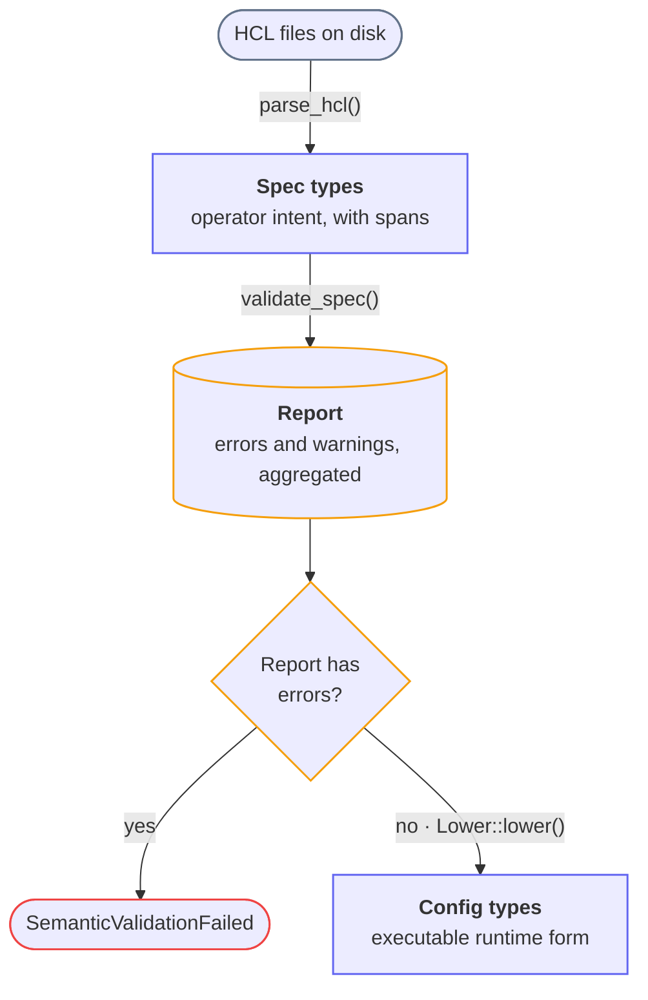

# Skill: mermaid-diagrams — Authoring Mermaid Diagrams in the Docs Site

This skill captures how to add a polished, theme-correct Mermaid diagram to the Snakeway
Docusaurus docs (`docs/`). It exists because the obvious approaches (hardcoded `classDef`
colors, `var()` in `classDef`, CSS overrides of node fills) fail in non-obvious ways. Follow the
patterns here and you avoid re-discovering each wall.

The docs toolchain uses Bun, not npm. Preview with `just docs`.

---

## Setup (one-time, already done)

Mermaid is enabled in `docs/docusaurus.config.ts`:

- `markdown: { mermaid: true }`
- `themes: ['@docusaurus/theme-mermaid']`

The default theme mapping is `{ light: 'default', dark: 'dark' }`. The diagram **re-renders on
color-mode change**, picking `theme[colorMode]`, so fill and text from the *theme* adapt to light
and dark automatically. This default fact is the lever the whole color strategy below depends on.

---

## The core constraint: custom colors cannot follow the theme

Two independent walls make per-element, theme-aware custom colors impossible in a single diagram.
Both were verified in the Mermaid 11.x source (`node_modules/mermaid/dist/mermaid.js`):

1. **The flowchart parser rejects `var(...)` in `classDef` values.** A `(` is a syntax error:
   `Parse error ... Expecting 'SEMI','COLON','NODE_STRING',... got '(-'`. So CSS custom properties
   cannot be referenced from the diagram source.
2. **`classDef` `fill`/`stroke` are applied as inline `!important` styles** on the shape element
   (Mermaid overwrites the shape's `style` attribute last with the `fill:… !important` form). Inline
   `!important` is the top of the CSS cascade, so **no stylesheet rule can override it**, regardless
   of specificity or `!important`.

Consequence: a hardcoded `classDef fill:#eef2ff` is identical in both modes. A near-white fill that
looks right in light mode **glows** on a dark background, and there is no CSS escape hatch.

---

## The pattern that works

**Put role-coding in the `stroke` only. Leave `fill` and `color` out of `classDef`, and let the
per-mode theme supply them.**

```
flowchart TD
    classDef io   stroke:#64748b,stroke-width:1.5px;
    classDef data stroke:#6366f1,stroke-width:1.5px;
    classDef diag stroke:#f59e0b,stroke-width:1.5px;
    classDef bad  stroke:#ef4444,stroke-width:1.5px;
```

Because no `fill`/`color` is set:

- The **fill** comes from the theme's `mainBkg` (light gray in `default`, dark gray in `dark`) and
  adapts per mode.
- The **text** comes from the theme's text color and adapts per mode.
- The **stroke** carries the role, and a mid-tone hue (slate / indigo / amber / red) reads on both
  light and dark node backgrounds.

This is the only approach that is correct in both modes without per-diagram maintenance.

---

## What CSS *can* do, in `docs/src/css/custom.css`

Anything the theme supplies (and `classDef` does **not** set inline-`!important`) is overridable with
a scoped `!important` rule. Scope to a color mode with the `data-theme` attribute Docusaurus sets on
`<html>` (`html:not([data-theme='dark'])` for light, `[data-theme='dark']` for dark).

The stable wrapper class for every diagram is **`.docusaurus-mermaid-container`**. Use it for spacing
and as a scoping prefix.

### Spacing around a diagram

```css
.docusaurus-mermaid-container {
  margin-block: 2.5rem;
}
```

### White node backgrounds in light mode only

Works *because* `classDef` sets no `fill` (so the theme fill is overridable). The node shapes are
`rect` (rectangles), `polygon` (diamonds), and `path` (stadiums, cylinders):

```css
html:not([data-theme='dark']) .docusaurus-mermaid-container .node :is(rect, polygon, path) {
  fill: #ffffff !important;
}
```

### Padding and rounding edge-label pills (target the inner `<p>`)

With `markdownAutoWrap` on (the default), an edge label is
`<foreignObject><div class="labelBkg"><span class="edgeLabel"><p>text</p></span></div>`. Mermaid's own
theme CSS sets `background-color` on `.edgeLabel`, on that inner `<p>`, **and** (faded) on `.labelBkg`
— so the `<p>` carries a visible background. Style **that inner `<p>`**, and leave the selector
unscoped:

```css
.labelBkg > span > p {
  padding: 2px 6px;
  border-radius: 6px;
}
```

Two reasons this is the right element, both learned the hard way:

1. **It is the measured content.** Mermaid measures the label width *off-DOM*, before the SVG is
   inserted into `.docusaurus-mermaid-container`, and centers the label on the edge from that width.
   Padding an outer wrapper (`.labelBkg`) via a container-scoped rule is absent during that
   measurement, so the padding renders but is not measured — the pill ends up wider than the centering
   assumed and the text is pushed sideways and out of its background (the "offset and obscured"
   symptom). The inner `<p>` is intrinsic measured content, and an unscoped rule is present at
   measurement time, so measured and rendered widths agree.
2. **It owns a background.** Because the `<p>` itself has `background-color`, padding extends the
   visible pill and `border-radius` rounds it. (`border-radius` on `.labelBkg` would not round the
   `<p>`'s own background.)

General lesson: any CSS that changes a label's *size* must be active during Mermaid's off-DOM
measurement — use an unscoped selector and prefer the innermost measured element, not a
`.docusaurus-mermaid-container`-prefixed wrapper. Color-only overrides that do not change size are safe
to scope to the container.

---

## Rendered DOM cheat-sheet (for writing CSS)

- Node: `<g class="node default <classDefClass>"> <rect|polygon|path class="...label-container..."/>
  <foreignObject> ... <span class="nodeLabel">…</span> </foreignObject> </g>`. The `classDef` class
  lands on the node `<g>`.
- Edge line: under `.edgePaths` / `.flowchart-link` (not `.node`), so a `.node` selector never hits
  arrows.
- Edge label: `.labelBkg` (div) > `.edgeLabel` (span) > `<p>` (text). With `markdownAutoWrap` (on by
  default) the text is wrapped in a `<p>`, and `background-color` is set on `.edgeLabel`, on that `<p>`,
  and (faded) on `.labelBkg` — so the `<p>` is the element to pad/round.

---

## Design choices that read as "designed", not auto-generated

- **Vary node shape by role.** Stadium `([text])` for an I/O boundary, cylinder `[(text)]` for an
  accumulator or store, diamond `{text}` for a decision, rectangle `[text]` for plain data. Varied
  shapes carry meaning and break the uniform-box look.
- **Restrained palette.** Encode role in the stroke with a small set of hues; do not give every box a
  different color. Two data boxes sharing a stroke color reads as "these are the same kind of thing".
- **Short edge labels.** Put the function or verb on the edge (`parse_hcl()`), and let the surrounding
  prose carry the explanation. Long labels clutter and look generated.
- **Soften branches** with `%%{ init: { "flowchart": { "curve": "basis" } } }%%` at the top.
- **Two-line node labels.** `"<b>Title</b><br/>subtitle"`. HTML labels (including `<b>` and `<br/>`)
  render under Docusaurus's default Mermaid security level. If a preview shows literal `<b>` tags,
  switch that label to plain text.
- Avoid em dashes in labels (house style); a colon or middle dot reads fine as a separator.

---

## Reference template

The configuration-pipeline diagram in `docs/docs/internals/configuration.md` is the canonical
example of all of the above:



The matching `.docusaurus-mermaid-container` rules (margin, light-mode white fill, edge-label
padding) live in `docs/src/css/custom.css`.

---

## Investigating Mermaid behavior

When a styling approach does not behave, read the source rather than guessing:

- `docs/node_modules/mermaid/dist/mermaid.js` — search `styles2String`, `userNodeOverrides`,
  `labelBkg`, `classDef` to see how class styles become inline attributes.
- `docs/node_modules/@docusaurus/theme-mermaid/lib/` — `validateThemeConfig.js` for the default
  light/dark theme mapping, `client/index.js` for the `theme[colorMode]` selection.

## Verifying

- `custom.css` is not always hot-reloaded; restart `just docs` (or hard-refresh) after CSS edits.
- Toggle dark mode and confirm: no glowing boxes, text legible in both, borders visible against the
  node fill. If a stroke is too faint on the dark node fill, lighten that one hue or bump
  `stroke-width`.
