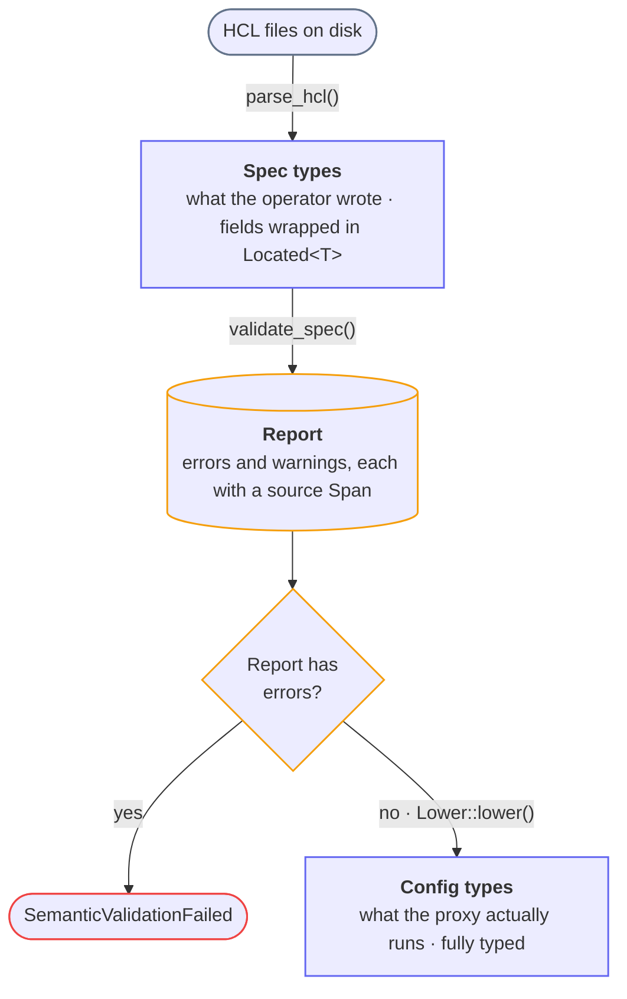

This page describes the `snakeway-conf` configuration subsystem and gives a precise recipe for adding a new setting.
The subsystem is built on the **confval** crate (span-first parsing, validation, and lowering).
For the generic primitives see the [confval internals page](../internals/confval.md).
This page is the applied, Snakeway-specific recipe.

Follow every step.
Skipping one produces a compile error (the derives enforce spec and config parity at compile time) or a silent no-op.

## How the Subsystem Works

Config loading is a strict, span-first pipeline:



The error gate is strict: lowering never runs on a report with errors.

Parsing is **structural only** (does the field exist, is it the right shape).
Every semantic rule (ranges, closed sets, cross-field invariants) runs in the validate phase, so the operator sees every
problem in one pass instead of one at a time.
Each value carries the byte `Span` it came from, so diagnostics point at the exact line and column.

The orchestrating code:

| File                                              | Role                                                           |
|---------------------------------------------------|----------------------------------------------------------------|
| `crates/snakeway-conf/src/loader.rs`              | Entry point: discovers files, parses, validates, gates, lowers |
| `crates/snakeway-conf/src/validation/validate.rs` | `validate_spec`: runs every validator, appending to the Report |
| `crates/snakeway-conf/src/lower.rs`               | `lower_configs`: assembles the final `RuntimeConfig`           |
| `crates/snakeway-conf/src/validation/error.rs`    | `ConfigError`, including `SemanticValidationFailed`            |

:::note
There is no `ValidationReport`, no `Origin`, and no `ValidateSpec` trait anymore.
Diagnostics use `confval::diagnostic::Report`, spans live in `Located<T>`, and field-local validation uses the
`confval::pipeline::Validate` trait.
If you see those old names anywhere, they are stale.
:::

## The Two-Type System: Spec vs Config

Every setting exists in **two parallel structs**:

- **Spec** (`crates/snakeway-conf/src/types/specification/`) derives `confval::Spec` and `Serialize`.
  It is populated by `parse_hcl`.
  Every field is wrapped in `Located<T>` so it carries its source span.
  No `Deserialize`, no `Origin` field.
- **Config** (`crates/snakeway-conf/src/types/runtime/`) derives `confval::Config` (and serde).
  It is the resolved, executable form, produced by lowering.
  It uses fully typed values (`SocketAddr`, `IpNet`, runtime enums, narrowed integer widths).

The conversion is generated by `#[derive(confval::Config)]`, declared on the Config struct with
`#[confval(lower_from = FooSpec)]`.
The `with` conversion functions live **in the runtime file alongside the Config struct**.

### Type Selection Principle

**Spec types use the rawest type that parses infallibly from HCL**, wrapped in `Located`.
That means `Located<String>`, `Located<HclInt>` (`HclInt` is the crate alias for `i64`, HCL's native integer),
`Located<bool>`, `Located<PathBuf>`, `Vec<Located<String>>`, and the `Option<...>` forms.
The structural parsers never reject a value for a semantic reason, so a port of `99999` or a strategy of `"failovr"`
parses fine and is caught by validation with a span, alongside every other problem.

**Keyword fields are `Located<String>` in specs.**
Closed sets (load-balancing strategies, log levels) are validated against a constant slice with a help line listing the
options.
The runtime enum implements `TryFrom<&str>` and the conversion happens at lowering.
Do not put serde keyword enums in the spec layer.

**Config types use the fully parsed, typed form.**
`IpNet`, `Method`, `HeaderName`, `SocketAddr`, runtime enums, exact integer widths.
Downstream code never re-parses a value it received from config.

**Lowering is the typing boundary.**
Validation checks values (read-only, collecting errors) and lowering produces the typed value.
Because the gate runs first, narrowing conversions inside lowering are safe.
A failure there means a validation rule is missing, not bad operator input, and it still reports with a span rather than
panicking.

### Field-Local Validation: The Validate Trait

Spec types implement `confval::pipeline::Validate` for checks a value can make from its own fields:

```rust
pub trait Validate {
    fn validate(&self, report: &mut Report);
}
```

The impl lives in the **same file as the spec struct** (for example, `ServerSpec` and its `Validate` impl both in
`types/specification/server/server_spec.rs`).
It takes only `&self` and the report, reporting at the span each field already carries.
Anything needing more context (a missing required child's enclosing span, a cross-field rule, a relational check across
files) goes in the centralized validators instead, not here.

`Validate` is also a compile-time bound.
A Config whose derive carries the `validate` flag (`#[confval(lower_from = FooSpec, validate)]`) will not compile unless
`FooSpec: Validate`.
This makes "a lowerable spec with no validator" unrepresentable.

## Recipe: Adding a Setting to the server Block

The server block lives in `snakeway.hcl`.
This is the most common case.

### Step 1: Add the field to the Spec struct

**File:** `crates/snakeway-conf/src/types/specification/server/server_spec.rs`

Add a `Located`-wrapped field to `ServerSpec`.
Use `Option<Located<T>>` for an optional setting, or `#[confval(default = expr)]` to fill an absent field with a
detached default:

```rust
#[derive(Debug, Serialize, confval::Spec)]
pub struct ServerSpec {
    // ... existing fields ...

    /// Maximum number of simultaneous downstream connections.
    #[serde(skip_serializing_if = "Option::is_none")]
    pub max_connections: Option<Located<HclInt>>,
}
```

Field attributes the `Spec` derive understands:

- Plain `Located<T>` leaf: dispatched by inner type to the matching parser.
- `Option<Located<T>>`: optional, absent is not an error.
- `#[confval(default = 30)]` / `#[confval(default)]`: fill an absent field instead of reporting it.
- `#[confval(nested)]`: the field is `Located<S>`, `Option<Located<S>>`, or `Vec<Located<S>>` where `S` itself derives
  `Spec` (or hand-writes `FromFields`).

If `ServerSpec` has a hand-written `Default`, update it to include the new field.

### Step 2: Add the field to the Config struct

**File:** `crates/snakeway-conf/src/types/runtime/server_config.rs`

Add the matching field to `ServerConfig` and declare how it lowers:

```rust
#[derive(Debug, Clone, Deserialize, Serialize, confval::Config)]
#[confval(lower_from = ServerSpec, validate)]
pub struct ServerConfig {
    // ... existing fields ...

    #[confval(lower(from = max_connections, with = narrow::opt_i64_to_u32))]
    pub max_connections: Option<u32>,
}
```

How a Config field obtains its value:

- **No attribute**: auto-maps from the same-named spec field, stripping `Located` without narrowing (`Located<T>` to
  `T`, `Option<Located<T>>` to `Option<T>`, `Vec<Located<T>>` to `Vec<T>`).
  Use this only when the types already match.
- **`#[confval(lower(from = field, with = fn))]`**: explicit conversion through a function
  `fn(&SpecFieldType, &mut Report) -> Option<Target>`.
  All narrowing and parsing goes here.
  `from` also takes a tuple `(a, b)` when one config field derives from several spec fields.
- **`#[confval(nested)]`**: the field's type is another Config that derives `Lower`.
  Works for single, `Option`, and `Vec` shapes.
- **`#[confval(spec_only(field, ...))]`** at the struct level names spec fields that intentionally have no runtime
  counterpart.

The generated `lower` destructures the spec exhaustively with **no rest pattern**, so a spec field consumed by nothing,
or a missing `from` target, is a compile error.
This is what keeps spec and config in lockstep.

For integer width changes, use `confval::pipeline::narrow` (re-exported as `confval::prelude::narrow`) as the `with`
function: `i64_to_u16`, `i64_to_u32`, `i64_to_u64`, `i64_to_usize`, and the `opt_` variants.
They narrow with `try_from`, so an out-of-range value reports at its span and fails lowering instead of silently
truncating like `as`.
For anything else, write a small `with` function next to the Config struct:

```rust
fn ca_file_to_string(
    value: &Option<Located<PathBuf>>,
    report: &mut Report,
) -> Option<Option<String>> {
    // ... convert, reporting at value.span on failure ...
}
```

Server (and device) configs lower through the `Config` derive, so **`lower.rs` needs no change for server fields**.

### Step 3: Add validation (if needed)

Field-local checks go in the `Validate` impl for the spec, in the spec file.
For numeric bounds, declare a `range_constraint!` and call `check_located`:

```rust
range_constraint!(MAX_CONNECTIONS, i64, min: 1, max: 1_000_000);

impl Validate for ServerSpec {
    fn validate(&self, report: &mut Report) {
        // ... existing checks ...

        if let Some(max_connections) = &self.max_connections {
            MAX_CONNECTIONS.check_located(max_connections, "max_connections", report);
        }
    }
}
```

For a one-off check, emit directly through the report builder:

```rust
report
    .error(format!("max_connections must be even, got {}", value.value))
    .at(value.span)
    .help("Set max_connections to an even number.")
    .emit();
```

`report.error(msg)` and `report.warning(msg)` return a builder.
Chain `.at(span)`, optional `.help(text)` and `.related(span, label)`, then `.emit()`.
The builder is `#[must_use]`, so forgetting `.emit()` is a compile warning.
Range and path helpers (`RangeConstraint::check_located`, `require_existing_file`, `require_existing_dir`) live in
`crates/snakeway-conf/src/validation/validator/`.

Cross-field checks on the same struct can stay in the `Validate` impl, which has all of `&self`.
What must move to a centralized validator is a check that needs an entity's *enclosing* span (a missing required child,
a presence rule) or a relation *across* entities or files, because neither is reachable from `&self`.
Those live under `validation/single_file/` (per-entity relational rules: `ingress.rs`, `device.rs`) and
`validation/multi_file/` (cross-file).
The server block is a single struct with no such checks, so all of its validation lives in its `Validate` impl.

### Step 4: Update the docs

When you add or change a config field, update the corresponding reference page under `docs/docs/configuration/`.
See [Writing Documentation](writing-documentation.md) for the spec-to-docs mapping and page conventions.

### Step 5: Verify

```sh
cargo check -p snakeway-conf -p snakeway -p snakeway
cargo nextest run -p snakeway-conf -p snakeway -p snakeway
just lint
```

For end-to-end coverage, the integration tests parse real config:

```sh
cargo nextest run -p snakeway-tests configuration::
```

## Variant: Adding a Setting to an Ingress Block

Ingress settings live in `ingress.d/*.hcl`.
The same shape applies, but ingress entities lower by flattening in `lower_configs` rather than through a single
top-level `Config` derive, so the lowering step differs:

| Step         | File                                                                                              |
|--------------|---------------------------------------------------------------------------------------------------|
| Spec field   | `crates/snakeway-conf/src/types/specification/ingress/...` (`bind/`, `service/`, `static_files/`) |
| Config field | The matching `*_config.rs` under `crates/snakeway-conf/src/types/runtime/`                        |
| Validation   | `impl Validate` in the spec file, plus relational rules in `validation/single_file/ingress.rs`    |
| Lowering     | See below                                                                                         |

If the entity is a plain struct, add a `Config` derive.
If it is built by a hand-written constructor in `lower.rs` (`ListenerConfig::from_bind`, `ServiceConfig::new`,
`StaticRouteConfig::new`), thread the new field through that constructor.

`lower.rs` constructs `ListenerConfig`, `ServiceConfig`, and `StaticRouteConfig` explicitly (these take `&mut Report`
and narrow their own integer fields), so ingress fields on those entities need the constructor updated.
Pure nested structs (filters, policies, compression options) instead derive `Config` and need no `lower.rs` change.

The `lower_configs` function carries a `where IngressSpec: Validate` bound.
This is the ingress family's equivalent of the `validate` flag, ensuring every ingress child entity is validatable at
compile time.

## Variant: Tagged Unions and Free-Form Blocks

The `Spec` derive only handles plain structs.
Two shapes are hand-written `FromFields` impls:

- **Tagged unions**: a block whose shape depends on a discriminator field.
  The impl reads the discriminator first and dispatches.
  `tls` blocks dispatch on **mode** (`manual` / `acme`), `cert_store` on **type** (`memory` / `filesystem`).
  See `tls_termination_spec.rs` and `tls_automation_spec.rs`.
- **Free-form blocks**: the WASM device's `config` blob is captured as an arbitrary value.
  Its `FromFields` impl reads the neutral field model and reconstructs an `hcl::Value` to hand the module untouched.
  See `wasm_device_spec.rs`.

Both spellings of a nested structure (block `bind { port = 8080 }` and attribute-with-object `bind = { port = 8080 }`)
normalize to the same `Fields` view in confval, so a hand-written impl never needs to know which the operator used.

## Variant: Cross-File (Multi-File) Validation

Some rules span multiple files, for example "if any ingress uses ACME TLS, the server block must configure
`tls_automation`".
These live in `crates/snakeway-conf/src/validation/multi_file/` and are called from `validate_spec`:

```rust
pub(crate) fn validate_spec(
    server: &ServerSpec,
    ingresses: &[Located<IngressSpec>],
    devices: &[Located<DeviceSpec>],
    report: &mut Report,
) {
    server.validate(report);
    if server.version.value == 1 {
        single_file::validate_ingresses(ingresses, report);
        single_file::validate_devices(devices, report);
        multi_file::validate_tls(server, ingresses, report);
        // multi_file::validate_my_cross_file_rule(server, ingresses, report);  // <- new
    }
}
```

Cross-file duplicate detection tracks a map from key to first-seen `Span`, so the second occurrence reports with a
`.related(first_span, "first declared here")` secondary location.

## Where Settings Appear in HCL

- **Server-level**: `snakeway.hcl`, inside `server { ... }`.
- **Ingress-level**: any file matched by `include.ingresses`, at the top level or inside `bind { ... }`,
  `services = [ { ... } ]`, or `static_files = [ { ... } ]`.
- **Device-level**: any file matched by `include.devices`, inside the named device block (for example
  `identity_device { ... }`).
  Device spec structs live in `crates/snakeway-conf/src/types/specification/device/` and are validated in
  `crates/snakeway-conf/src/validation/single_file/device.rs`.
