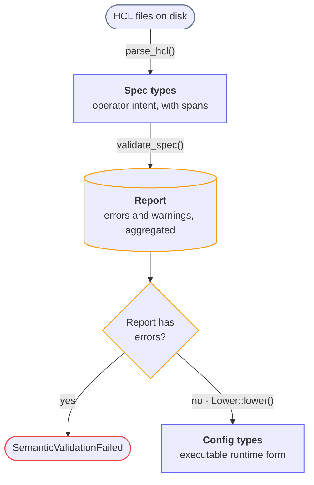

This page describes how to add a theme-correct Mermaid diagram to the docs site.
Mermaid styling has sharp edges under Docusaurus, so follow these patterns rather than styling ad hoc.

Preview your work with `just docs`.

## Setup

Mermaid is already enabled in `docs/docusaurus.config.ts`:

- `markdown: { mermaid: true }`
- `themes: ['@docusaurus/theme-mermaid']`

The theme mapping is `{ light: 'default', dark: 'dark' }`.
Diagrams re-render when the reader toggles color mode, so any color the theme supplies adapts to light and dark automatically.
The styling rules below exist to preserve that behavior.

## Constraints

Two Mermaid behaviors rule out per-element custom colors that follow the theme:

1. The flowchart parser rejects `var(...)` in `classDef` values, so CSS custom properties cannot be referenced from diagram source.
2. `classDef` `fill` and `stroke` become inline `!important` styles on the shape element, which no stylesheet rule can override.

A hardcoded `classDef fill` is therefore identical in both color modes.
A fill chosen for light mode will glow on a dark background, with no CSS override available.

## Color Nodes by Stroke Only

Set only `stroke` in `classDef`.
Leave `fill` and `color` unset so the per-mode theme supplies them.

```
flowchart TD
    classDef io   stroke:#64748b,stroke-width:1.5px;
    classDef data stroke:#6366f1,stroke-width:1.5px;
    classDef diag stroke:#f59e0b,stroke-width:1.5px;
    classDef bad  stroke:#ef4444,stroke-width:1.5px;
```

With no `fill` or `color` set:

- The fill comes from the theme and adapts per mode.
- The text color comes from the theme and adapts per mode.
- The stroke carries the role.
  Mid-tone hues (slate, indigo, amber, red) read well on both light and dark node backgrounds.

This is the only approach that stays correct in both modes without per-diagram maintenance.

## Site CSS Overrides

Styles the theme supplies (rather than `classDef`) can be overridden in `docs/src/css/custom.css` with a scoped `!important` rule.
Scope to a color mode with the `data-theme` attribute on `<html>`: `html:not([data-theme='dark'])` for light and `[data-theme='dark']` for dark.
Every rendered diagram is wrapped in `.docusaurus-mermaid-container`, which is the stable hook for spacing and scoping.

The site already defines these rules.

Spacing around each diagram:

```css
.docusaurus-mermaid-container {
  margin-block: 2.5rem;
}
```

White node backgrounds in light mode, possible because `classDef` sets no `fill`:

```css
html:not([data-theme='dark']) .docusaurus-mermaid-container .node :is(rect, polygon, path) {
  fill: #ffffff !important;
}
```

Padding and rounding on edge-label pills:

```css
.labelBkg > span > p {
  padding: 2px 6px;
  border-radius: 6px;
}
```

The edge-label rule targets the inner `<p>` and stays unscoped for two reasons:

1. Mermaid measures label widths off-DOM, before the SVG lands inside `.docusaurus-mermaid-container`, and centers each label from that measurement.
   A container-scoped padding rule is not active during measurement, so the rendered pill grows wider than the centering assumed and the text shifts out of its background.
   An unscoped rule on the inner `<p>` is active during measurement, so measured and rendered widths agree.
2. The `<p>` carries its own `background-color`, so padding extends the visible pill and `border-radius` rounds it.

:::caution
Any CSS that changes a label's size must be active during Mermaid's off-DOM measurement.
Keep size-affecting rules unscoped and target the innermost measured element.
Color-only overrides are safe to scope to the container.
:::

## Rendered DOM Reference

- Node: `<g class="node default <classDefClass>">` containing the shape (`rect`, `polygon`, or `path`) and a `<foreignObject>` with the label.
  The `classDef` class lands on the node `<g>`.
- Edge line: under `.edgePaths` as `.flowchart-link`, outside `.node`, so node selectors never hit arrows.
- Edge label: `.labelBkg` (div) containing `.edgeLabel` (span) containing `<p>` (text).
  The `<p>` carries the visible background and is the element to pad and round.

## Design Guidelines

- **Vary node shape by role.**
  Stadium `([text])` for an I/O boundary, cylinder `[(text)]` for a store or accumulator, diamond `{text}` for a decision, rectangle `[text]` for plain data.
- **Keep the palette small.** Encode role in the stroke with a few hues.
  Two boxes sharing a stroke color signals that they are the same kind of thing.
- **Keep edge labels short.**
  Put the function or verb on the edge, such as `parse_hcl()`, and explain in the surrounding prose.
- **Soften branch lines** with `%%{ init: { "flowchart": { "curve": "basis" } } }%%` at the top of the diagram.
- **Use two-line node labels** in the form `"<b>Title</b><br/>subtitle"`.
  HTML labels render under the default Mermaid security level.
  If a preview shows literal `<b>` tags, switch that label to plain text.
- Avoid em dashes in labels, matching the [prose style rules](writing-documentation.md#prose-style).
  A colon or middle dot works as a separator.

## Reference Template

The configuration-pipeline diagram in `docs/docs/internals/configuration.md` applies all of the above:

````

````

## Debugging

When a styling approach misbehaves, check the installed source:

- `docs/node_modules/mermaid/dist/mermaid.js`: search `styles2String`, `userNodeOverrides`, `labelBkg`, or `classDef` to see how class styles become inline attributes.
- `docs/node_modules/@docusaurus/theme-mermaid/lib/`: `validateThemeConfig.js` holds the default theme mapping and `client/index.js` selects the theme per color mode.

## Verifying

- Restart `just docs` or hard-refresh after editing `custom.css`.
  It is not always hot-reloaded.
- Toggle dark mode and confirm there are no glowing boxes, text is legible in both modes, and borders are visible against the node fill.
  If a stroke is too faint on the dark fill, lighten that hue or increase `stroke-width`.
