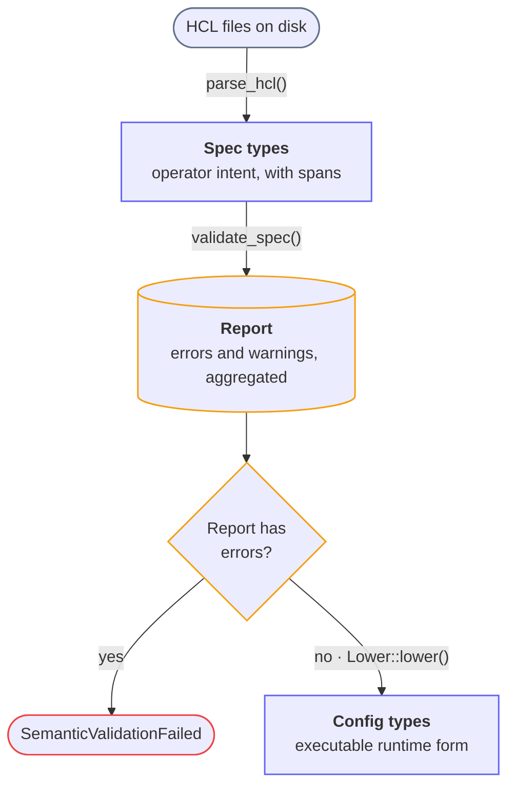

The configuration subsystem lives in the `snakeway-conf` crate. It is responsible for reading HCL
files from disk, checking them for semantic correctness, and producing the runtime types that the
rest of the proxy reads. It is built on the primitives provided by [confval](https://ethanhann.com/confval).

## The pipeline

Every startup (and every config-check run) passes through four ordered phases:



**Parse** is structural and strict. Each file is registered in a `SourceMap` and parsed with
`confval::format::hcl::parse_hcl`. Unknown fields, wrong types, missing required fields, and duplicate
blocks are reported with spans. Parsing continues across files: a file whose tree was built keeps
flowing into validation even if some of its fields failed, so the operator sees parse and validation
problems in one pass. Only a file that produced no tree at all (a syntax error) stops the load, and
even then only after every file has been read, so all syntax errors are reported together.

**Validate** never panics and never returns early. Every validator receives `&mut Report` and
appends issues to it. Spans come from the `Located` fields on the specs, so validation works the
same whether the spec was parsed from a file or constructed in code.

**Gate**: if the report contains any errors after validation, `load_config` returns
`ConfigError::SemanticValidationFailed { report, sources }` without lowering. Warnings alone do not
block startup.

**Lower** converts spec types to config types via the `Lower` trait. Because the gate ran, the
narrowing conversions inside lowering (string to `IpNet`, `i64` to `u16`) are safe; a failure here
indicates a missing validation rule, not bad operator input. Lowering errors report through the
same span pipeline (a second gate after lowering returns `SemanticValidationFailed`), so even a
missing-rule bug renders with a source location.

## Entry points

All entry points live in `crates/snakeway-conf/src/loader.rs`:

```rust
pub fn load_config(root: &Path) -> Result<ValidatedConfig, ConfigError>
```

`ValidatedConfig` bundles the result with its diagnostics:

```rust
pub struct ValidatedConfig {
    pub config: RuntimeConfig,
    pub report: Report,      // warnings that survived the gate
    pub sources: SourceMap,  // needed to render them
}
```

Two more entry points serve other callers:

- `load_spec_files(root)` runs only the parse phase and returns
  `(SourceMap, Report, ServerSpec, Vec<Located<DeviceSpec>>, Vec<Located<IngressSpec>>)`. The
  `config dump --repr spec` command uses this.
- `load_config_from_specs(server, ingresses, devices)` skips files entirely and runs
  validate-gate-lower on specs built in Rust. The integration-test `ConfigBuilder` uses this; the
  spec values are wrapped in `Located::detached`, so validation messages render without source
  locations but otherwise behave identically.

## Spec types vs Config types

Every setting exists in two parallel structs:

| Layer      | Location                                        | Derives                      | Purpose                                                |
|------------|-------------------------------------------------|------------------------------|--------------------------------------------------------|
| **Spec**   | `crates/snakeway-conf/src/types/specification/` | `confval::Spec`, `Serialize` | Populated from HCL; every field is span-tracked        |
| **Config** | `crates/snakeway-conf/src/types/runtime/`       | `confval::Config`, serde     | Resolved, executable form used by the proxy at runtime |

Spec fields are wrapped in `Located<T>`:

```rust
#[derive(Debug, Serialize, confval::Spec)]
pub struct ServerSpec {
    pub version: Located<HclInt>,
    pub threads: Option<Located<HclInt>>,

    #[confval(nested)]
    pub tls_automation: Option<Located<TlsAutomationSpec>>,

    #[confval(default = 30)]
    pub dns_refresh_interval_seconds: Located<HclInt>,
}
```

Config structs declare how each field lowers:

```rust
#[derive(Debug, Clone, Deserialize, Serialize, confval::Config)]
#[confval(lower_from = ServerSpec)]
pub struct ServerConfig {
    #[confval(lower(from = version, with = i64_to_u32))]
    pub version: u32,

    #[confval(nested)]
    pub tls_automation: Option<TlsAutomationConfig>,

    pub ca_file: Option<String>,  // auto-mapped, Located stripped
}
```

The generated lowering destructures the spec exhaustively, so adding a field to one side without
accounting for it on the other is a compile error. The `with` functions live in the runtime module
next to the config struct they serve.

### Type selection principle

**Spec types use the rawest type that parses infallibly from HCL.** Strings, `HclInt` (an alias for
`i64`, HCL's native integer type), bools, paths. The structural parsers never reject a value for
semantic reasons, so a port of `99999` or a strategy of `"failovr"` parses fine and is caught by
validation with a span, alongside every other problem.

**Keyword fields are `Located<String>` in specs.** Closed sets like load-balancing strategies or
log levels are validated against a constant slice, with a help line listing the options. The
runtime enum implements `TryFrom<&str>` and the conversion happens at lowering. There are no serde
keyword enums in the spec layer; a typo there would abort parsing with a single error instead of
joining the report.

**Config types use the fully parsed, typed form.** `IpNet`, `Method`, `HeaderName`, `SocketAddr`,
runtime enums. Downstream code never re-parses a string it received from config.

**Hand-written `FromFields` impls cover the shapes the derive does not.** Tagged unions parse their
discriminator first and dispatch: `tls` blocks on **mode** (`manual` or `acme`), `cert_store`
blocks on **type**. The WASM device's free-form `config` block is captured as an arbitrary value
rather than a struct: its `FromFields` impl reads the neutral field model and reconstructs an
`hcl::Value` to hand the module untouched.

## Both HCL spellings

Operators write nested structures either as blocks or as attribute-with-object, and real configs
mix the two:

```hcl
tls_automation {
  enable = true
}

tls_automation = {
  enable = true
}
```

The `Fields` view in confval normalizes both, so every nested spec accepts either spelling with
identical spans and identical error messages.

## File discovery

`snakeway.hcl` is the entrypoint. It contains an `include` block with two glob patterns:

```hcl
server {
  version = 1
}

include {
  devices   = "device.d/*.hcl"
  ingresses = "ingress.d/*.hcl"
}
```

`discover()` in `crates/snakeway-conf/src/discover.rs` resolves each pattern relative to the config
root and returns an ordered list of paths. Ordering is deterministic (lexicographic within each
directory), which matters for listener naming.

## Validation

Validation is split between entity-local `Validate` impls and centralized relational validators.

### Entity Validate impls

Each spec implements `confval::pipeline::Validate` to check its own fields:

```rust
impl Validate for ServerSpec {
    fn validate(&self, report: &mut Report) {
        if let Some(threads) = &self.threads {
            THREADS.check_located(threads, "threads", report);
        }
        // ...
    }
}
```

These impls live next to the spec struct they validate (for example `BindSpec` in the bind module,
`ServiceSpec` in the service module). They cover ranges (via `RangeConstraint::check_located`),
closed keyword sets, format checks, and path existence. Because spans live inside the `Located`
fields, the method takes only `&self` and the report; no span or origin parameter is threaded
through.

A `Validate` impl checks one spec type's own fields.
Reaching the nested blocks beneath it is a separate step, done by `validate_all`.
`validate_all` runs this spec's `validate` and then calls `validate_all` on each nested child in turn.
The traversal comes from `ValidateNested`, which `#[derive(Spec)]` generates from the `#[confval(nested)]` fields.
The [confval pipeline reference](https://ethanhann.com/confval/docs/pipeline) documents the two methods in full.

For example, each central validator makes one call per entity and reaches the whole subtree:

```rust
spec.validate_all(report); // this spec's own rules, then every nested child
```

Calling `validate` instead checks the one spec and stops there.
Only the central validators start a validation, so they are the only callers of `validate_all`.

Sometimes a block does not apply to the configuration that is running, such as a disabled device or a `server` block whose version this build does not recognize.
Its nested children are still in the file, and checking them reports on settings that will not run.
Override `descend` to prune the subtree in that case.
For example, `ServerSpec` stops at an unrecognized version:

```rust
impl Validate for ServerSpec {
    fn validate(&self, report: &mut Report) { /* ... */ }

    fn descend(&self) -> ControlFlow<()> {
        if self.version.value == 1 { ControlFlow::Continue(()) } else { ControlFlow::Break(()) }
    }
}
```

`NetworkPolicyDeviceSpec` does the same for a disabled device.
The prune has to be explicit.
A disabled block reports nothing of its own, so a rule like "descend unless the block reported an error" would still walk into it.

The `Validate` trait is not just a convention. It is a compile-time bound on lowering: a spec that
can be lowered into a runtime config but has no validator fails to compile. The bound lives where
each family lowers:

- **Server** and the **device** configs carry it on their `Lower` impls
  (`impl Lower<ServerSpec> for ServerConfig where ServerSpec: Validate + ValidateNested`, written as
  `#[confval(lower_from = ServerSpec, validate)]` on the derive, and as an explicit `where` clause on
  the hand-written device impls).
- **Ingresses** lower by flattening in `lower_configs` rather than through a per-entity `Lower` impl,
  so the bound is a `where IngressSpec: Validate + ValidateNested` clause on that function.

The generated `ValidateNested` impl calls `validate_all` on every nested child.
A child without a `Validate` impl fails to compile at its parent.
Adding a nested block to a spec cannot leave it unchecked.
The earlier hand-written delegation could omit the child, and nothing caught the omission.

You cannot produce a `RuntimeConfig` from a spec family whose entities are not all validatable.
The compiler guarantees that a validator exists and that every nested child is reached.
It does not guarantee that lowering runs them.
Validation is invoked explicitly by the orchestrator below, before the lowering gate.

What does **not** belong in a `Validate` impl is any check needing more than `&self`: a missing
required child needs the entity's enclosing span, which lives on the `Located` wrapper the caller
holds, so those presence checks live in the central validator instead (see below). The same reason
puts "route has no hosts" in `ServiceSpec` rather than in `ServiceRouteSpec`, and the missing
`bind_admin.auth` scheme in `BindAdminSpec` rather than in `AdminAuthSpec`.

### Centralized validators

Cross-field and cross-file rules live under `crates/snakeway-conf/src/validation/`:

- `single_file/ingress.rs` and `single_file/device.rs` walk every parsed ingress and device,
  run each entity's validation with `ingress.validate_all(report)` and
  `device_cfg.validate_all(report)`, and check relational rules within and across files: duplicate bind
  addresses, duplicate route paths, HTTP/2 and TLS dependency, WebSocket and HTTP/2 conflict.
  Cross-file duplicates are tracked in a map from key to first-seen `Span`, so the second occurrence
  reports with a related span labelled "first declared here". The single-entity presence checks
  ("ingress must have a bind or bind_admin", "service has no upstream backends", "bind_admin.auth is
  required") also live here, because each points at an entity's enclosing span that a `Validate` impl
  cannot reach from `&self`.
- `multi_file/tls.rs` checks invariants that span the entrypoint and the ingress set: ACME TLS
  requires `server.tls_automation`; a configured `tls_automation` with no TLS listener anywhere
  earns a warning.

The orchestrator ties it together:

```rust
pub(crate) fn validate_spec(
    server: &ServerSpec,
    ingresses: &[Located<IngressSpec>],
    devices: &[Located<DeviceSpec>],
    report: &mut Report,
)
```

It returns nothing; all findings land in the report. Server validation always runs; the
ingress, device, and multi-file validators only run when **version** is a recognized schema
version, since their rules are defined per schema version.

:::note
A required field that fails structural parsing makes its entity's parse return `None`, which means
the entity's semantic checks do not run that pass. The operator fixes the structural error first and
sees the semantic findings on the next run.
:::

## Diagnostics

When the gate trips, `load_config` returns:

```rust
ConfigError::SemanticValidationFailed {
report: confval::diagnostic::Report,
sources: confval::source::SourceMap,
}
```

`snakeway config check` renders this in one of three formats (`--format pretty|plain|json`), all
provided by confval. Pretty output is rustc-style with source excerpts and carets:

```shell
error: unknown cert_store type: filesyste
  --> config/snakeway.hcl:14:12
   |
14 |     type = "filesyste"
   |            ^^^^^^^^^^^
   = help: expected "memory" or "filesystem"
```

The remaining `ConfigError` variants cover hard failures outside the report: file I/O and glob
resolution.

On a successful load, warnings still surface: `ValidatedConfig::has_warnings()` and
`render_plain` let callers print them without failing startup.

## Key files at a glance

The first six rows live in the external [confval repository](https://ethanhann.com/confval), not in this workspace.
The `conf/` rows are `crates/snakeway-conf/src/`.

| File                           | Responsibility                                                                       |
|--------------------------------|--------------------------------------------------------------------------------------|
| `confval/src/source/`          | `Located`, `Span`, `SourceId`, `SourceMap`                                           |
| `confval/src/diagnostic/`      | `Report`, `Issue`, `Severity`, the renderers                                         |
| `confval/src/pipeline/`        | `Lower`, `LowerAuto`, `Validate`, `ValidateNested`, `narrow`, `RangeConstraint`      |
| `confval/src/format/field.rs`  | the neutral field model and `FromFields`, leaf and struct parsers                    |
| `confval/src/format/hcl.rs`    | `parse_hcl`: the HCL frontend (`format/toml.rs` is the TOML one)                     |
| `confval-derive/src/lib.rs`    | `#[derive(Spec)]` and `#[derive(Config)]`                                            |
| `conf/loader.rs`               | `load_config`, `load_spec_files`, `load_config_from_specs`, the gate                 |
| `conf/discover.rs`             | Glob-based file discovery                                                            |
| `conf/parse.rs`                | `flatten_devices`: device file to per-device specs                                   |
| `conf/lower.rs`                | `lower_configs`: assembles the final `RuntimeConfig` (`where IngressSpec: Validate`) |
| `conf/types/specification/`    | All `*Spec` structs with their `Validate` impls                                      |
| `conf/types/runtime/`          | All `*Config` structs, `Lower` derives, and `with` conversion functions              |
| `conf/validation/validate.rs`  | `validate_spec` orchestrator                                                         |
| `conf/validation/single_file/` | Per-file relational validators (ingress, device)                                     |
| `conf/validation/multi_file/`  | Cross-file validators (TLS)                                                          |
| `conf/validation/error.rs`     | `ConfigError` enum                                                                   |
