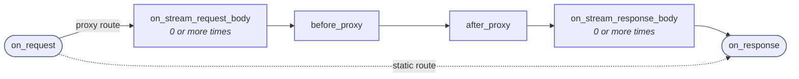

Snakeway processes every HTTP request through a well-defined lifecycle composed of discrete, ordered phases.
Read that again, because it is important to understand.

Each phase has a specific purpose, a constrained set of capabilities, and clear rules about what may or may not happen next.

Understanding this lifecycle is critical when writing devices or reasoning about request behavior.

## Request and response phases

For **proxied requests**, the full lifecycle flows left to right through all six phases.

For **static file requests**, the lifecycle short-circuits from `on_request` directly to `on_response` (the dashed path).
Static routes never create an upstream connection and therefore skip all proxy-specific phases.

## Phase overview

### `on_request`

**Purpose:** Inspection, early decisions, and request mutation **Runs for:** Proxy routes and static routes

This is the earliest hook in the lifecycle.
Devices may:

- Inspect request method, path, headers, and body
- Mutate request metadata
- Enforce authentication or authorization
- Decide to immediately return a response

If a device responds here, no further processing occurs.

### `on_stream_request_body`

**Purpose:** Inspection and mutation of the request body **Runs for:** Proxy routes

This hook is only called if there is a request body.
It is skipped when there is no body, or when the method does not expect one, as with GET.

Typical uses:

- Inspect body for specific content
- Deny request based on body size

If a device responds here, no further processing occurs.

### `before_proxy`

**Purpose:** Final upstream mutation or abort **Runs for:** Proxy routes only

This phase runs **only if the request is being proxied upstream**.

Typical uses include:

- Modifying upstream headers or paths
- Injecting identity or routing metadata
- Aborting the upstream request

This phase is **never executed for static routes**.

### `after_proxy`

**Purpose:** Modify the upstream response before it is sent downstream **Runs for:** Proxy routes only

This phase observes the upstream response headers and status before they are written to the client.
Devices may:

- Modify response headers
- Override the response status
- Record errors or metrics

The upstream connection already exists at this point.

### `on_stream_response_body`

**Purpose:** Inspection and mutation of the response body **Runs for:** Proxy routes

This hook is called as the upstream response body is streamed to the client.
It may be invoked zero or more times depending on the response size and chunking.

Typical uses:

- Inspect response body content
- Enforce response size limits

If a device responds here, no further body chunks are forwarded.

### `on_response`

**Purpose:** Final observation and side effects **Runs for:** Proxy routes and static routes

This is the final lifecycle hook.
The response is considered committed or about to be committed.

Devices should treat this phase as **observe-only**, used for:

- Structured logging
- Metrics
- Tracing
- Auditing

Mutating the response here is allowed but discouraged for anything security-critical.

## Phase capabilities

| Phase                   | Continue | Respond                | Error Handling       |
|-------------------------|----------|------------------------|----------------------|
| on_request              | proceed  | respond immediately    | respond with 500     |
| on_stream_request_body  | proceed  | respond immediately    | respond with 500     |
| before_proxy            | proceed  | abort before upstream  | respond with 500     |
| after_proxy             | proceed  | override response      | mark error / observe |
| on_stream_response_body | proceed  | stop forwarding body   | mark error / observe |
| on_response             | proceed  | override (discouraged) | log + metric only    |

## Static route lifecycle notes

Static file routes intentionally **short-circuit** the proxy pipeline.

For static routes:

- `on_request` **runs**
- `on_stream_request_body` **does not run**
- `before_proxy` **does not run**
- `after_proxy` **does not run**
- `on_stream_response_body` **does not run**
- `on_response` **runs**

:::caution
Any **security-critical logic** (authentication, authorization, access control) that must apply to static files **must live in `on_request`**.

Proxy-only phases must never be relied upon for static route enforcement.
:::

## Design guarantees

- Phases always execute in the documented order.
- A response returned in an earlier phase halts the lifecycle.
- Static routes never reach upstream infrastructure.
- Devices are never invoked out of band.

You can rely on these when writing a device, so a device does not need to re-check work an earlier phase already did.

