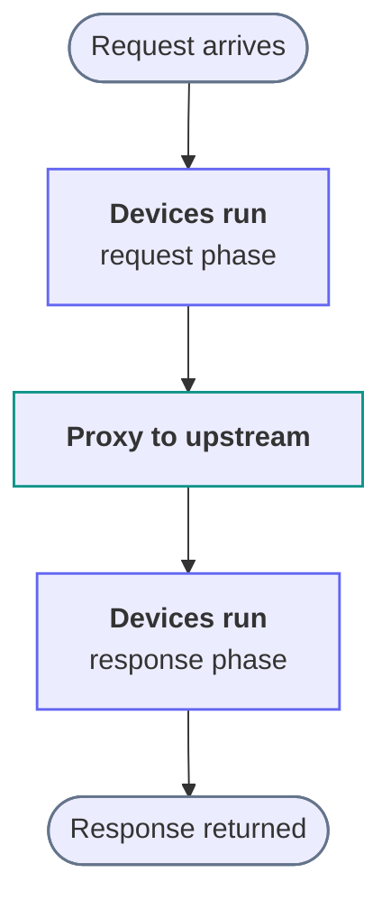

Once you have configured a route or two, the next question is usually what Snakeway does with a request between accepting it and answering it.
This page describes that path.
Everything else in the documentation, from device reference pages to WASM authoring, describes one stage of the path this page lays out.

## The core loop

Snakeway processes traffic as a linear pipeline.
A request arrives, the configured devices run in order, the request is proxied to an upstream, the devices run again on the response, and the response goes back to the client.
There is no hidden branching, no background retry, and no implicit reordering.
The order you configure is the order that runs.

## Requests are context objects

A device is not a handler bound to a route.
A device is a stage that receives a context object and may read it, change it, or stop the pipeline.

Two context objects carry the state.

- `RequestCtx` holds the incoming request and the state that accumulates as devices run.
- `ResponseCtx` holds the upstream response, or a response generated inside Snakeway.

Devices communicate through a typed extension store on the context.
A device inserts a strongly typed value, and any later device retrieves it by type.
The value lives for the duration of one request, is never forwarded upstream, and is never logged unless a device asks for it.
Because the data lives on the context rather than in a call graph, adding a device does not change what the devices around it do.

### A worked example

Consider a listener with Request Filter, Identity, Network Policy, Request Rate Limiting, and Structured Logging enabled.
A request moves through them in turn.

1. **Request Filter** checks the method, the required and denied headers, and the body size against its rules.
   A request that fails a rule ends with the configured deny status, so nothing after this point runs.
2. **Identity** resolves the client IP from `X-Forwarded-For` and the trusted proxy configuration, performs the GeoIP lookup, and parses the user agent.
   It inserts a `ClientIdentity` extension into the request context.
3. **Network Policy** reads `ClientIdentity` and checks the resolved IP against its CIDR lists.
   A disallowed IP ends the request with `403 Forbidden`.
4. **Request Rate Limiting** reads `ClientIdentity`, keys its sliding window on the resolved IP, and rejects with `429 Too Many Requests` when the client is over its budget.
5. **Structured Logging** emits a tracing event carrying the method, URI, and the identity fields you selected.

Network Policy and Request Rate Limiting both depend on the `ClientIdentity` that Identity produced.
Neither device calls Identity, and neither knows Identity exists.
Each reads the extension it needs, and the pipeline order guarantees the value is there.
Request Filter reads no extension, which is why it can run ahead of Identity and reject a malformed request before any identity work is done.

:::note
A WASM device you write yourself joins the same pipeline and reads the same extensions.
See [Authoring WASM Devices](/docs/extension/authoring-wasm-devices) for the interface.
:::

## The device pipeline

The pipeline order is resolved once at startup and is the same for every request.
Two constraints shape it.
Identity runs ahead of any device that reads `ClientIdentity`, and Structured Logging runs last among the builtin devices so its event reflects the decisions the earlier devices made.

WASM devices currently run after all builtin devices, including Structured Logging.
A log entry therefore does not yet reflect mutations a WASM device made.
A future release moves WASM devices ahead of Structured Logging.

## Device phases

A device does not have to participate in the whole lifecycle.
It implements the hooks it needs and inherits a no-op for the rest.

| Hook                      | When it runs                                                |
|---------------------------|-------------------------------------------------------------|
| `on_request`              | The request headers have been received and the route matched |
| `on_stream_request_body`  | Each chunk of the request body, so possibly many times       |
| `before_proxy`            | Immediately before the upstream call                         |
| `after_proxy`             | The upstream response headers have arrived                   |
| `on_stream_response_body` | Each chunk of the response body                              |
| `on_response`             | Final response handling                                      |
| `on_ws_open`              | A WebSocket tunnel opened                                    |
| `on_ws_close`             | A WebSocket tunnel closed                                    |
| `on_error`                | A device returned an error                                   |

Most devices implement one or two of these.
Identity does its work in `on_request`, and Structured Logging does its work in `on_response`.
For the capability constraints of each phase, see [Lifecycle](/docs/internals/lifecycle).

## Responding early

A device may end the pipeline by returning a response instead of continuing.
Network Policy does this on a denied CIDR, Request Filter does it on a rejected method, and the static file handler does it by serving the file it found.

When a response is finalized this way, the upstream call never happens.
Later request-phase devices do not run.
Response-phase devices still see the response that was produced, so logging and metrics stay accurate for a rejected request.

## Proxying is one outcome, not the only one

Snakeway is a proxy, and proxying is one of three ways a request can end.

- It is forwarded to an upstream service.
- It is answered inside Snakeway, as with a static file route or a device that returns a synthetic response.
- It is rejected before any upstream is selected.

Static routes skip the proxy-only phases entirely.
`on_request` and `on_response` run, while `before_proxy`, `after_proxy`, and the body streaming hooks do not.
Put any access control that must apply to static files in `on_request`.

## Errors are lifecycle events

A device reports failure by returning an error value, not by panicking.
The pipeline calls that device's `on_error` hook, stops running further devices, and the proxy answers the client with `500 Internal Server Error`.

Because the failure travels as a value, a device can record what went wrong before the pipeline unwinds.
Structured Logging implements `on_error` for exactly that reason, so a request that failed inside the pipeline is logged with the same shape as one that succeeded.

## Concurrency

Each request is processed independently on a Pingora worker thread.
A device is shared across all of them, so it must be `Send + Sync`, and any state it keeps across requests has to be explicitly synchronized.
A device that only reads its configuration and writes to the request context needs no synchronization at all.

This is why the model holds up as a proxy scales.
A device is a function over one request's context, so nothing about its behavior depends on how many other requests are in flight.

## Where the model stops

The pipeline is designed for work that finishes in the time budget of a single request.
A device that queries a database, calls a third-party API, or waits on a lock held across requests puts unbounded latency on a worker thread.

If a behavior needs that, it belongs in an upstream service, and Snakeway routes to it.
If a behavior needs to run on a schedule rather than per request, it belongs in the control plane rather than the device pipeline.
See [Control Plane and Data Plane](/docs/internals/control-plane-and-data-plane) for that boundary.
