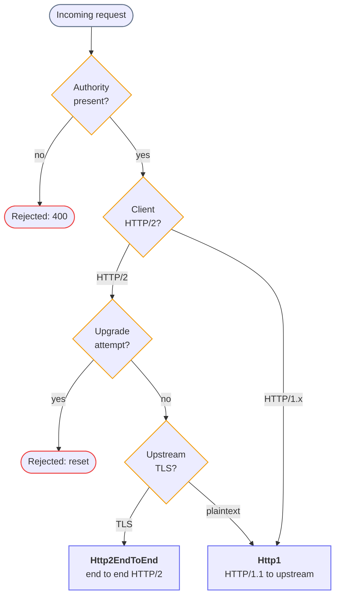
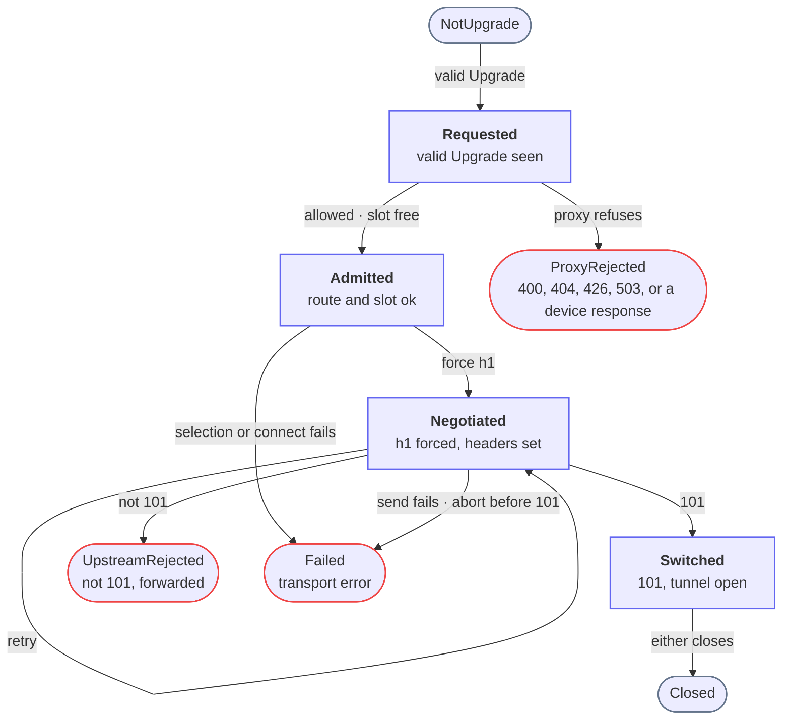

HTTP protocol negotiation covers two independent concerns, and each is handled by its own machine.

Version negotiation decides which HTTP version Snakeway speaks to the upstream.
Three inputs map to one mode, computed at upstream selection and never revised.

Upgrade negotiation decides whether the connection is turned into a tunnel, as for a WebSocket.
It spans several proxy hooks and is driven by the upstream `101` response.
Rejection is terminal at two layers, the proxy and the upstream itself.
An upgrade constrains version negotiation to HTTP/1.1.

## Version negotiation

The version is resolved once, in the `upstream_peer` hook, from three facts: whether the downstream request is HTTP/2, whether the selected upstream uses TLS, and whether the request is an upgrade.
The result is a `ProtocolMode` (`Http1` or `Http2EndToEnd`) stored on the request context and read by the later hooks, so the outcome is decided in a single place instead of being derived again at each hook.

HTTP/2 is offered to clients only over TLS.
There is no cleartext HTTP/2 (h2c) listener.

The `Host source` column is the value Snakeway sends as the upstream `Host` (or the HTTP/2 `:authority`).
An upgrade resolves to `Http1`, with the handshake handled by the upgrade machine described below.

| Downstream | Initiation                  | Upstream TLS | Resolved mode                                            | Host source                                                                                      |
|------------|-----------------------------|--------------|----------------------------------------------------------|--------------------------------------------------------------------------------------------------|
| HTTP/2     | none                        | TLS          | `Http2EndToEnd`                                          | upstream authority (overrides client)                                                            |
| HTTP/2     | none                        | plaintext    | `Http1`                                                  | client `:authority` via downstream authority, or the client `Host` if the h2 request carried one |
| HTTP/1.1   | none                        | TLS          | `Http1`                                                  | client `Host` header (passed through)                                                            |
| HTTP/1.1   | none                        | plaintext    | `Http1`                                                  | client `Host` header (passed through)                                                            |
| HTTP/1.1   | Upgrade                     | any          | `Http1`                                                  | client `Host` header (passed through)                                                            |
| HTTP/1.0   | none, with `Host`           | any          | `Http1` (upgraded to h1.1 upstream)                      | client `Host` header (passed through)                                                            |
| HTTP/1.0   | none, without `Host`        | any          | rejected with 400 (no authority to forward)              | n/a                                                                                              |
| HTTP/1.1   | none, without `Host`        | any          | rejected with 400 (no authority to forward)              | n/a                                                                                              |
| HTTP/2     | Upgrade header              | any          | rejected at the h2 codec as malformed (never reaches Snakeway) | n/a                                                                                              |
| HTTP/2     | Extended CONNECT (RFC 8441) | any          | not supported: Pingora resets the stream                 | n/a                                                                                              |

## Upgrade negotiation

The only supported upgrade mechanism is the HTTP/1.1 `Upgrade` handshake (a WebSocket).
It forces HTTP/1.1 to the upstream regardless of the version negotiation, because the mechanism does not exist in HTTP/2.
WebSocket over HTTP/2 (RFC 8441 Extended CONNECT) is not supported, because Pingora does not implement it.
Snakeway does not advertise `SETTINGS_ENABLE_CONNECT_PROTOCOL`, and such a request is reset.

The states are the variants of `UpgradeState`, seeded at hydration and carried on the request context.
Each hook advances the machine through a transition method, and each state that holds a pool slot owns its guard.

An upgrade progresses through these states:

| From       | Event                                                                | To                           |
|------------|----------------------------------------------------------------------|------------------------------|
| NotUpgrade | `request_filter` sees a valid `Upgrade`                              | Requested                    |
| Requested  | the route allows WebSockets and a connection slot is acquired        | Admitted                     |
| Requested  | the proxy refuses the handshake                                      | ProxyRejected                |
| Admitted   | `upstream_request_filter` forces h1 and sets upgrade headers         | Negotiated                   |
| Admitted   | upstream selection or the upstream connection fails                  | Failed                       |
| Negotiated | a Pingora retry re-runs the upgrade request                          | Negotiated                   |
| Negotiated | upstream returns `101`                                               | Switched                     |
| Negotiated | upstream returns a non-informational status other than `101`         | UpstreamRejected (forwarded) |
| Negotiated | the send fails or the upstream aborts before `101`                   | Failed                       |
| Switched   | either side closes, cleanly or through a transport error             | Closed                       |

`Failed` exits from `Admitted` as well as `Negotiated` because Pingora establishes the upstream connection between `upstream_peer` and `upstream_request_filter`.
A connect failure or timeout therefore strikes while the machine is still in `Admitted`, and so does an upstream selection error or a `before_proxy` device error.
The `Negotiated` self-transition covers a Pingora retry, which re-runs `upstream_peer` and `upstream_request_filter` when a reused upstream connection fails.

Reaching `Switched` runs the WebSocket open hook and suppresses the normal response lifecycle.
`Closed` runs the WebSocket close hook.
A transport error after the `101` still terminates in `Closed`, because the close hook runs regardless of how the tunnel ended.
A rejected or failed handshake runs neither hook.

`ProxyRejected` happens in `request_filter`, before any upstream is contacted.
The status the proxy returns depends on why it refused.

| Status              | Condition                                    |
|---------------------|----------------------------------------------|
| `404`               | No route matches                             |
| `400`               | The route serves static files                |
| `426`               | The route forbids WebSockets                 |
| `503`               | The connection pool is full                  |
| `500`               | An `on_request` device returned an error     |
| the device's status | An `on_request` device responded directly    |

`UpstreamRejected` happens when the upstream answers the handshake with a non-informational status other than `101`.
The response is forwarded through the normal response lifecycle.

A request can also end while the machine is still in `Requested`, for example when the client aborts before routing completes.
No slot is held in that state, so nothing needs releasing.

The `Negotiated` state has no timeout.
An upstream that connects but never sends `101` will hang, because Pingora's single read timeout cannot bound the handshake without also tearing down an idle established tunnel.
