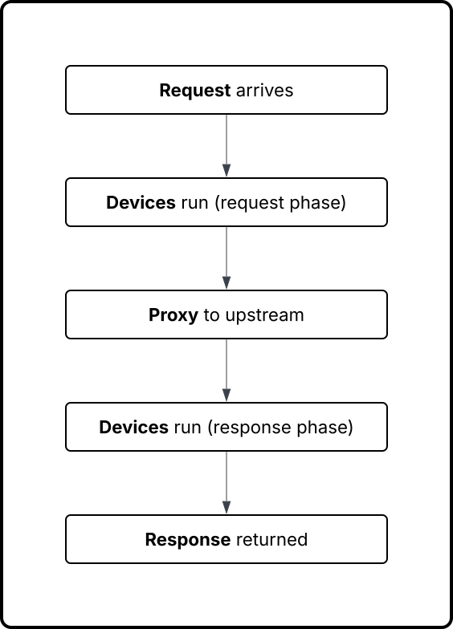

This page explains **how Snakeway thinks about traffic**.

If you understand this page, you understand Snakeway.
Everything else (e.g., configuration, devices, WASM, observability) is an implementation detail layered on top.

## The Core Loop

Snakeway processes traffic as a **linear, deterministic pipeline**.

It is a **pipeline you configure**, and your code runs *inside that pipeline* with clear boundaries and guarantees.

There is no hidden branching, background magic, or implicit retries.

What you configure is exactly what happens.

For every request:



## Requests Are Context, Not Handlers

Snakeway does **not** think in terms of “routes with handlers.”

Instead, it thinks in terms of **context objects** flowing through the system.

Two primary contexts exist:

- `RequestCtx` — represents the incoming request and its evolving state
- `ResponseCtx` — represents the upstream or locally-generated response

Devices receive mutable access to these contexts and can:

- Inspect them
- Modify them
- Decide whether processing should continue

This is why Snakeway scales cleanly: logic is applied *to data*, not embedded *in control flow*.

Example of a simple pipeline:

**Device 1: Identity device**

The builtin identity device creates a new identity context object.
This object is attached to the request context and is available to later devices in the pipeline.

**Device 2: Fraud signal detection device**

A fraud signal detection device is planned for the future.
It will access the identity context and produce its own fraud context object which will be attached to the request
context.

**Device 3: Operator-defined WASM device**

An operator defined third-party WASM device might access both the identity context the fraud context.
It can make decisions based on both and then take action perhaps to...

1. Block the request
2. Modify headers
3. Forward to upstream

## The Device Pipeline

Devices are executed in a strict, ordered sequence.

Order is explicit and intentional.

Example:

```
1. Identity device
2. Structured logging device
3. Fraud signal detection device
4. Throttling device
```

This ordering guarantees:

- Deterministic behavior
- Predictable side effects
- Easy reasoning under failure

If two devices conflict, the configuration—not the runtime—decides who wins.

### Device Phases

Each device can hook into specific phases of the request lifecycle.

Conceptually:

```
1. on_request: Request received
2. before_proxy: Just before upstream call
3. after_proxy: Upstream response received
4. on_response: Final response handling
5. on_error: Unrecoverable failure
```

Not every device needs every phase.

Most devices do one thing well, at one point in the lifecycle.

### Short-circuiting (i.e., responding early) is a Feature

Devices are allowed to **stop the pipeline early**.

This is intentional.

Examples:

- A device rejects a request due to validation failure
- A static file device serves a response directly
- A rules engine returns a cached response

Once a response is finalized, downstream devices see the result—but upstream proxying never happens.

This makes Snakeway fast by default and avoids unnecessary work.

### Proxying Is Optional

Snakeway is a proxy, but **proxying is not mandatory**.

A request may:

- Be proxied to an upstream
- Be handled entirely within Snakeway
- Be rejected before reaching any service

This flexibility is what enables:

- Static file serving
- Edge logic
- Traffic gating
- Synthetic responses

Upstreams are just one possible outcome of the pipeline.

### Errors Are First-Class

Errors are not exceptions flying out of the system.

They are **events in the lifecycle**.

When something goes wrong:

- Devices can observe the error
- Devices can log, count, or transform it
- A response can still be generated deterministically

This prevents “half-failed” requests and undefined behavior.

## Concurrency Model (High Level)

Snakeway is highly concurrent, but **devices do not manage concurrency**.

### Key Ideas

- Each request is processed independently
- Devices must be thread-safe
- Shared state must be explicit and intentional

This keeps device authors focused on logic, not synchronization.

### What This Model Buys You

This mental model enables:

- Predictable performance
- Debuggable behavior
- Safe extensibility
- Minimal hidden coupling

It also enforces discipline.

If a behavior is hard to explain using this model, it probably doesn't belong in Snakeway.
For example, if you have a service that needs to talk to a database, it probably belongs in an upstream service
and not in the device pipeline.
